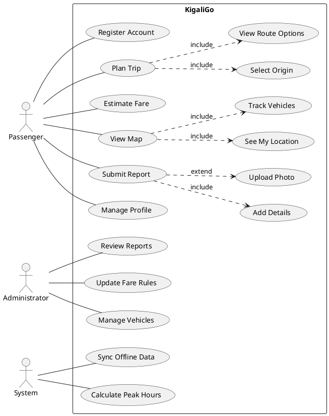
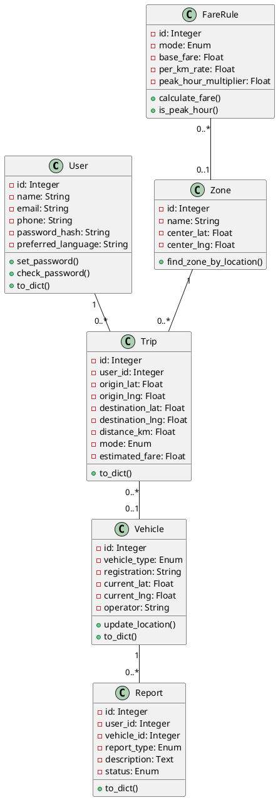

# Diagram Creation Guide for KigaliGo Proposal

This guide helps you create the required diagrams for your proposal based on the text descriptions provided.

## Required Diagrams

1. **Figure 1:** Development Model Diagram
2. **Figure 2:** System Architecture Diagram
3. **Figure 3:** Use Case Diagram
4. **Figure 4:** Class Diagram
5. **Figure 5:** Entity-Relationship Diagram (ERD)

## Tools You Can Use (FREE)

### Recommended: draw.io (diagrams.net)
- **URL:** https://app.diagrams.net/
- **Best for:** Architecture, ERD
- **Pros:** Free, no registration, saves to Google Drive/local
- **Cons:** None

### PlantUML
- **URL:** https://plantuml.com/
- **Best for:** UML diagrams (Use Case, Class)
- **Pros:** Text-based (code to diagram), professional output
- **Cons:** Learning curve

### Lucidchart
- **URL:** https://lucid.app/
- **Best for:** All diagram types
- **Pros:** Beautiful templates, collaborative
- **Cons:** Free tier has document limit

### Creately
- **URL:** https://creately.com/
- **Best for:** UML diagrams
- **Pros:** Great UML templates
- **Cons:** Watermark on free tier

## Step-by-Step Instructions

---

## Figure 1: Development Model Diagram

### Using draw.io:

1. Go to https://app.diagrams.net/
2. Choose "Create New Diagram"
3. Select "Blank Diagram"
4. From left panel, drag:
   - **Rectangles** for phases
   - **Arrows** for flow
   - **Diamond shapes** for decision points

### Layout Structure:

```
┌─────────────────────────────────────────────┐
│  Phase 1: Research & Requirements (Wk 1-4) │
│  - Literature Review                         │
│  - User Surveys                              │
│  - Requirements Analysis                     │
└──────────────┬──────────────────────────────┘
               ↓
┌──────────────────────────────────────────────┐
│  Phase 2: Design (Wk 4-6)                    │
│  - Database Schema                            │
│  - UI/UX Mockups                              │
│  - System Architecture                        │
└──────────────┬───────────────────────────────┘
               ↓
┌──────────────────────────────────────────────┐
│  Phase 3: Iterative Development (Wk 6-9)     │
│  ┌─────────────────┐                         │
│  │ Sprint 1 (Wk6-7)│                         │
│  │ Auth & Database │                         │
│  └────────┬────────┘                         │
│           ↓                                   │
│  ┌─────────────────┐                         │
│  │ Sprint 2 (Wk7-8)│                         │
│  │ Map & Vehicles  │                         │
│  └────────┬────────┘                         │
│           ↓                                   │
│  ┌─────────────────┐                         │
│  │ Sprint 3 (Wk8-9)│                         │
│  │ Fare & Reports  │                         │
│  └─────────────────┘                         │
└──────────────┬───────────────────────────────┘
               ↓
┌──────────────────────────────────────────────┐
│  Phase 4: Testing & Validation (Wk 9-11)     │
│  - Unit Testing                               │
│  - Usability Testing                          │
│  - Bug Fixes                                  │
└──────────────┬───────────────────────────────┘
               ↓
┌──────────────────────────────────────────────┐
│  Phase 5: Deployment & Documentation (11-12) │
│  - Documentation                              │
│  - Cloud Deployment                           │
│  - Final Presentation                         │
└──────────────────────────────────────────────┘
```

**Colors:**
- Phase 1 (Research): Light Blue
- Phase 2 (Design): Light Green
- Phase 3 (Development): Light Orange
- Phase 4 (Testing): Light Yellow
- Phase 5 (Deployment): Light Purple

---

## Figure 2: System Architecture (3-Tier)

### Using draw.io:

1. Create 3 horizontal sections (tiers)
2. Use cloud shapes for external services
3. Use cylinder shapes for databases
4. Use rectangles for application components

### Layout:

```
┌─────────────────────────────────────────────────┐
│           PRESENTATION LAYER                     │
├─────────────────────────────────────────────────┤
│  ┌──────────┐  ┌──────────┐  ┌──────────┐      │
│  │  React   │  │ Service  │  │OpenStreet│      │
│  │   PWA    │  │ Worker   │  │   Map    │      │
│  └──────────┘  └──────────┘  └──────────┘      │
└────────────────────┬────────────────────────────┘
                     │ HTTPS/JSON
                     ↓
┌─────────────────────────────────────────────────┐
│           APPLICATION LAYER                      │
├─────────────────────────────────────────────────┤
│             Flask Backend API                    │
│  ┌──────┐ ┌──────┐ ┌──────┐ ┌──────┐           │
│  │ Auth │ │Vehicle│ │ Fare │ │Report│           │
│  │  API │ │  API  │ │  API │ │  API │           │
│  └──────┘ └──────┘ └──────┘ └──────┘           │
│                                                  │
│  ┌────────────────────────────────────┐         │
│  │    Business Logic Layer            │         │
│  │  - Fare Calculation                │         │
│  │  - Distance Algorithms             │         │
│  └────────────────────────────────────┘         │
└────────────────────┬────────────────────────────┘
                     │ SQL Queries
                     ↓
┌─────────────────────────────────────────────────┐
│              DATA LAYER                          │
├─────────────────────────────────────────────────┤
│          PostgreSQL Database                     │
│  ┌──────┐ ┌──────┐ ┌──────┐ ┌──────┐           │
│  │users │ │vehicles│ │zones│ │trips │           │
│  └──────┘ └──────┘ └──────┘ └──────┘           │
└─────────────────────────────────────────────────┘
```

---

## Figure 3: Use Case Diagram

### Using PlantUML (easiest for UML):

Go to http://www.plantuml.com/plantuml/uml/ and paste this code:



**Or manually in draw.io:**
1. Drag "Ellipse" shapes for use cases
2. Drag "Actor" stick figure for users
3. Draw lines connecting actors to use cases
4. Use dashed arrows for <<include>> and <<extend>>

---

## Figure 4: Class Diagram

### Using PlantUML:



---

## Figure 5: Entity-Relationship Diagram (ERD)

### Using draw.io:

1. Choose "Entity Relation" template
2. For each table:
   - Use rectangle with table name as header
   - List attributes inside
   - Mark PK with key icon
   - Mark FK with reference
3. Connect tables with lines:
   - **One-to-Many:** Line with crow's foot (three lines) on "many" side
   - **One-to-One:** Line with single bar on both ends

### Tables to include:

```
┌──────────────┐         ┌──────────────┐
│    users     │         │   vehicles   │
├──────────────┤         ├──────────────┤
│ PK id        │         │ PK id        │
│    name      │         │ vehicle_type │
│    email     │         │ registration │
│    phone     │         │ current_lat  │
│ password_hash│         │ current_lng  │
└──────┬───────┘         └──────┬───────┘
       │ 1                      │ 1
       │                        │
       │ N                      │ N
       ▼                        ▼
┌──────────────┐         ┌──────────────┐
│    trips     │         │   reports    │
├──────────────┤         ├──────────────┤
│ PK id        │         │ PK id        │
│ FK user_id   │         │ FK user_id   │
│ FK vehicle_id│         │ FK vehicle_id│
│ origin_lat   │         │ report_type  │
│ dest_lat     │         │ description  │
│ distance_km  │         │ status       │
└──────────────┘         └──────────────┘

┌──────────────┐         ┌──────────────┐
│    zones     │         │ fare_rules   │
├──────────────┤         ├──────────────┤
│ PK id        │         │ PK id        │
│    name      │         │    mode      │
│    code      │         │ base_fare    │
│ center_lat   │         │ per_km_rate  │
│ center_lng   │         │ FK zone_id   │
└──────┬───────┘         └──────────────┘
       │ 1
       │
       │ N
       ▼
┌──────────────┐
│    stops     │
├──────────────┤
│ PK id        │
│ FK zone_id   │
│    name      │
│    lat       │
│    lng       │
└──────────────┘
```

**Relationship lines:**
- users → trips: One-to-Many (1:N)
- vehicles → trips: One-to-Many (1:N)
- vehicles → reports: One-to-Many (1:N)
- users → reports: One-to-Many (1:N)
- zones → stops: One-to-Many (1:N)
- zones → fare_rules: One-to-Many (1:N)

---

## Export Settings

When exporting from any tool:

1. **Format:** PNG or JPEG
2. **Resolution:** At least 300 DPI
3. **Size:** Large enough to read text when printed
4. **Background:** White (not transparent)
5. **File naming:** 
   - `figure1_development_model.png`
   - `figure2_system_architecture.png`
   - `figure3_use_case_diagram.png`
   - `figure4_class_diagram.png`
   - `figure5_erd.png`

## Inserting into Word Document

1. Place cursor where diagram should appear
2. Insert → Pictures → This Device
3. Select your diagram file
4. Right-click image → "Insert Caption"
5. Add caption: "Figure 1: Development Model Diagram"
6. Center align the image
7. Ensure image is clear when zoomed to 100%

## Quality Checklist

Before finalizing diagrams:

- [ ] All text is readable (font size 10pt minimum)
- [ ] Colors are distinguishable (avoid red-green combinations)
- [ ] Arrows clearly show direction of flow/relationships
- [ ] All boxes/shapes are properly aligned
- [ ] Legend included if using color coding
- [ ] No overlapping text or shapes
- [ ] Professional appearance (consistent fonts, spacing)
- [ ] Diagrams match the descriptions in the document

---

**Need help with a specific diagram? I can provide more detailed instructions or alternative approaches!**
